##  Swiftgard

Web app: https://swiftgard.com

Get it on Google play: https://play.google.com/store/apps/details?id=com.swiftgard.app

Introductory video: https://drive.google.com/file/d/1HYSZX6y3raQn6tj4di-W72TRiLdXSReM/view?usp=sharing

Swiftgard is a calculator and ability reference tool created for players of the international non-profit, Amtgard. It organizes the rules of play from the Amtgard rulebook ( 90 pages )into a steamlined application from an ever evolving document.

## How it works:

Technology:

Users do not need to log into this application. All data is stored in their browser's local storage or in their android device's app data directory. The application is about 5MB, so its lightweight and minimalistic. This application was build mostly using Typescript/javascript and is able to be downloaded via APK or from the Google play store for offline use. ( Amtgard participants often attend event locations that has poor reception. ) 

Why the app is useful:

Amtgard is a game that requires players to choose a class and build an ability or spell list based on the class they choose. ( Imagine capture the flag with extra steps. ) The application handles all of the heavy lifting of calculating spell costs, tracking points rounded down to lower levels, and displays an easy to read list limitation and additions based on the choices made. This gives players the ability to maximize their time spent on building a strong list for their game and not worry about the math involved or if they've build the list correctly based on the most recent Amtgard rule set.

### Main Flow

1. Creating a list starts on the Home page. Click the + icon to be brought to the creation page.
2. Pick a `name`, choose a `class`, `level` and if you have `look the part`. ( A bonus that yields extra points/abilities to your list if you meet the requirements of 'Dressing like the chosen class' ).
3. Click Create and now you will see your new list on the Home page. You can long click on this page to edit that list's details. Tap/Click the list to navigate to the details page.
4. As a spell caster, you can purchase spells based on your level and bonuses on the edit page. As a martial class, you have unique choices based on the class you choose.
5. On the edit page, choose your spell preferences. If you've chosen a caster class, the application will guide you on how many points you have left by level. If you've chosen a martial class, this page will display spell details and give you choices IF that class has any available.
6. Maximum spell purchase limits are displayed in a Toast ( popup message ) and will display any restricted spells in red based on your purchases.
7. Long press on any spell to reference its details and frequency.
8. Once done creating your list, click Done Editing or the back button to see your finished product.
9. Tapping/Clicking on the check boxes will display incantations or other spell/ability details for quick reference.
10. Versions are displayed on this page, and alerts appear if a user is using an oout of date spell list.

### Extra features

The three dot menu offers a few extra features:
- The ability to turn off helpful tips if they no longer need them.
- A patch notes page to reference to see the changes implimented or if a bug has been addressed.
- A bug reporting and feature request page.

### Future additions

- Dark mode
- Ability to choose between new editions as they come out.
- Local storage items for details page check boxes to remember a user's preference to see any item checked across multiple lists.
- Export to text/way to share lists
- More toasts describing successful actions ( List creation, deletion, etc. )
- Consolidated version of spell list and level version of spell lists options on details page.
   
Screenshots:

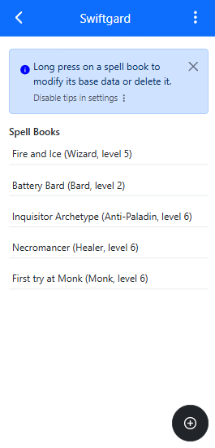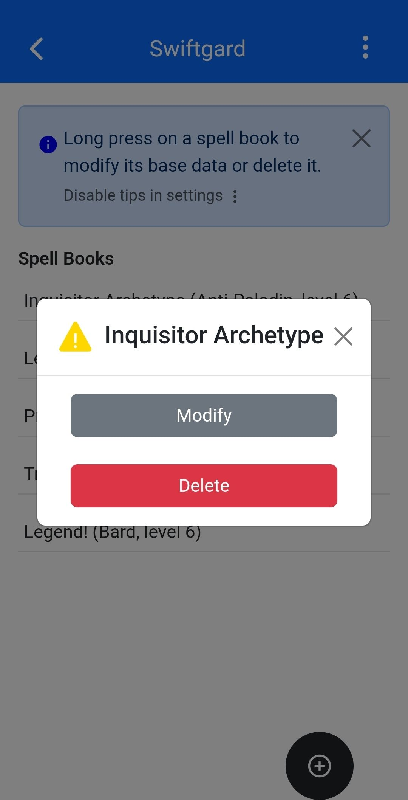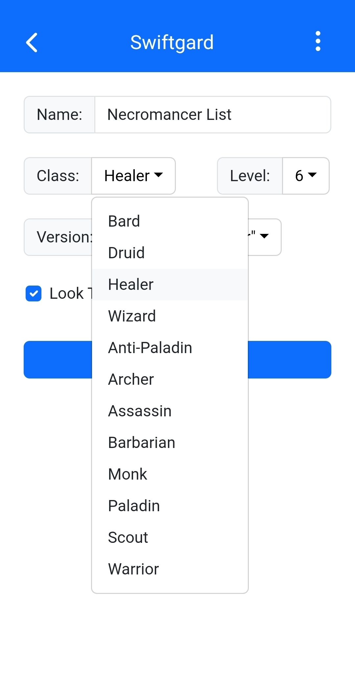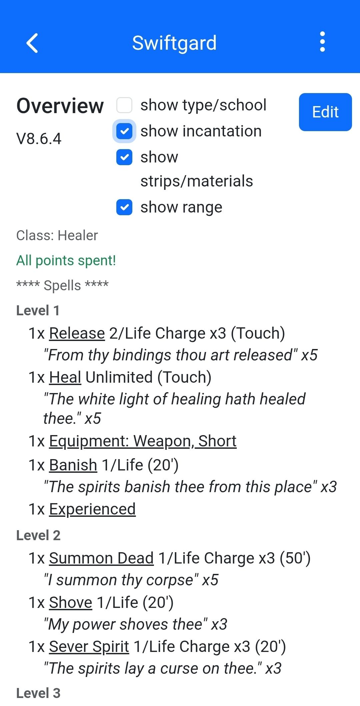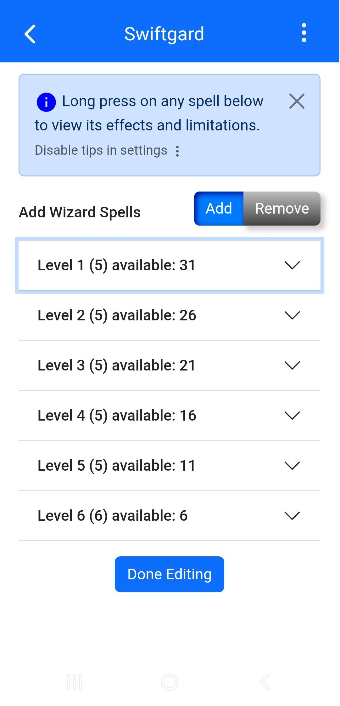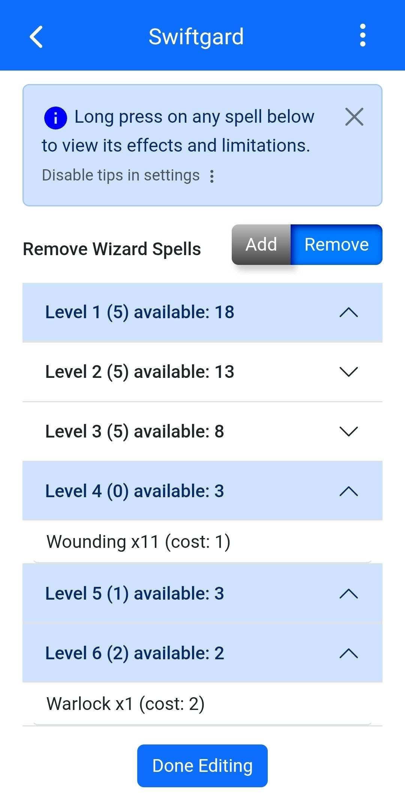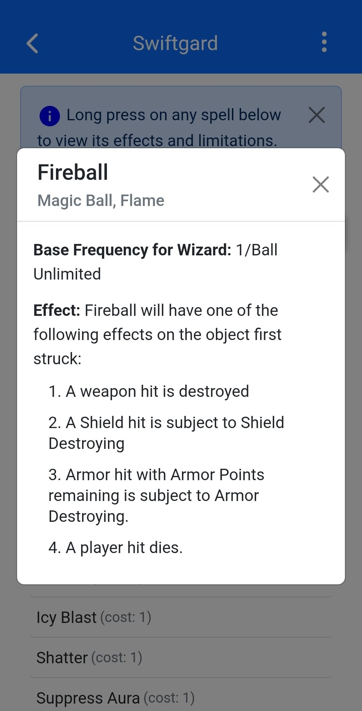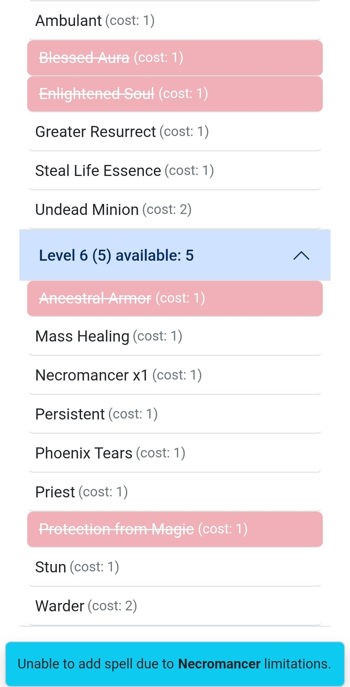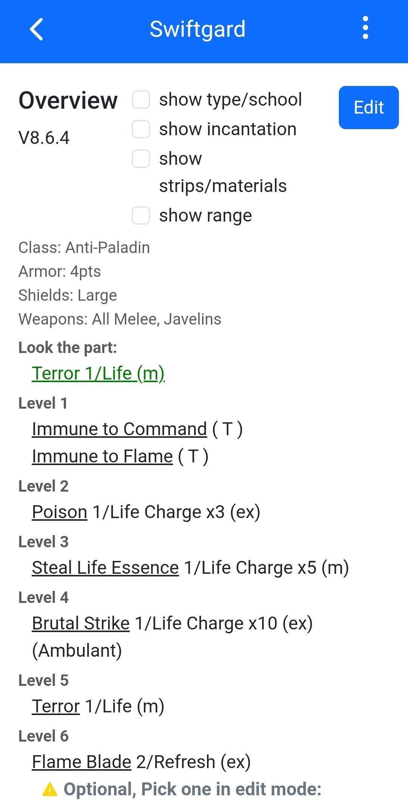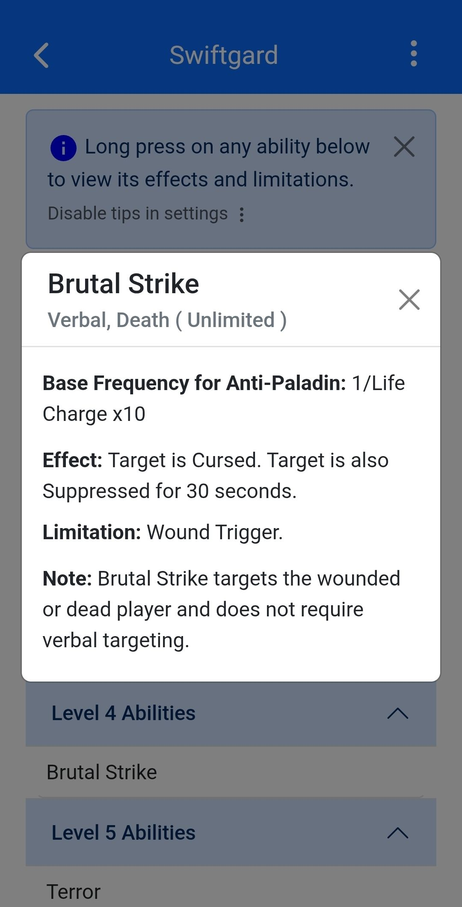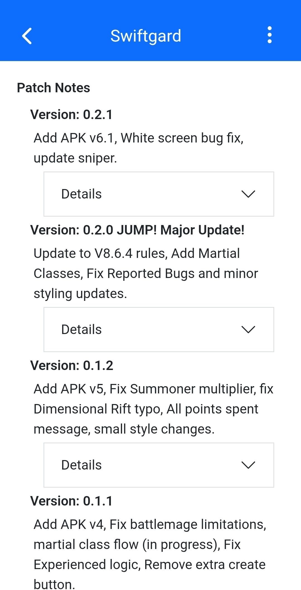
